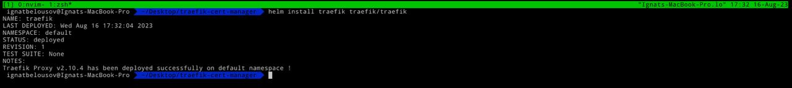
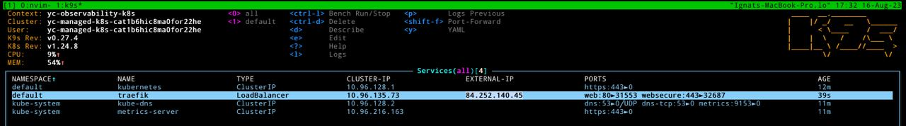
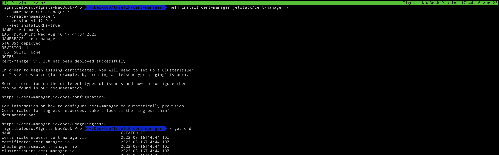
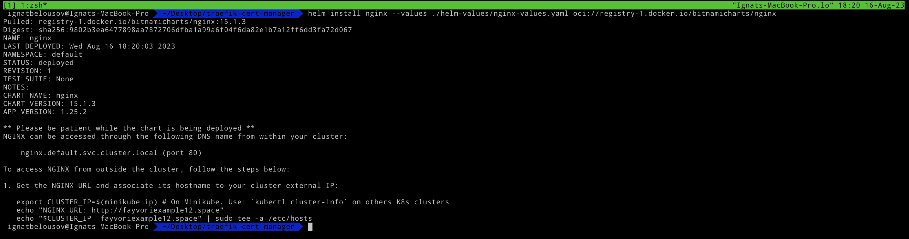
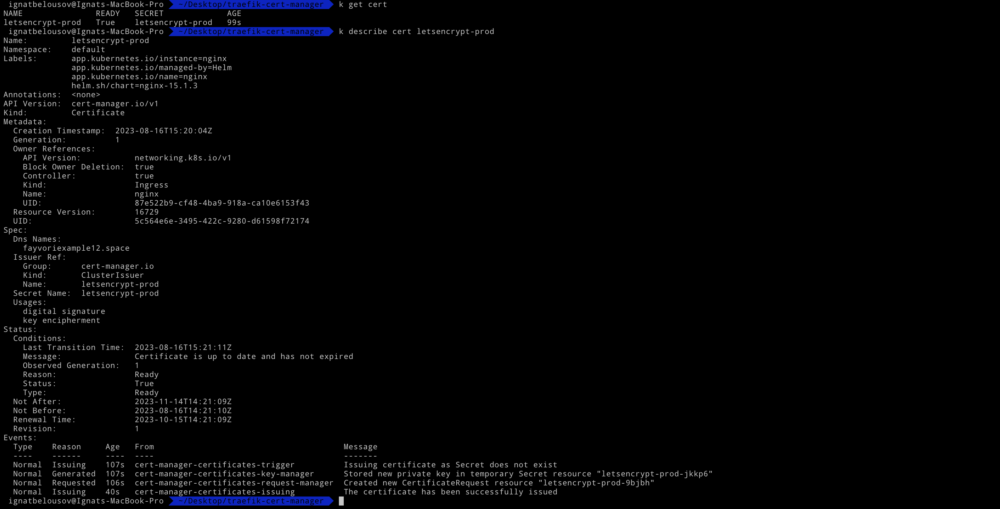
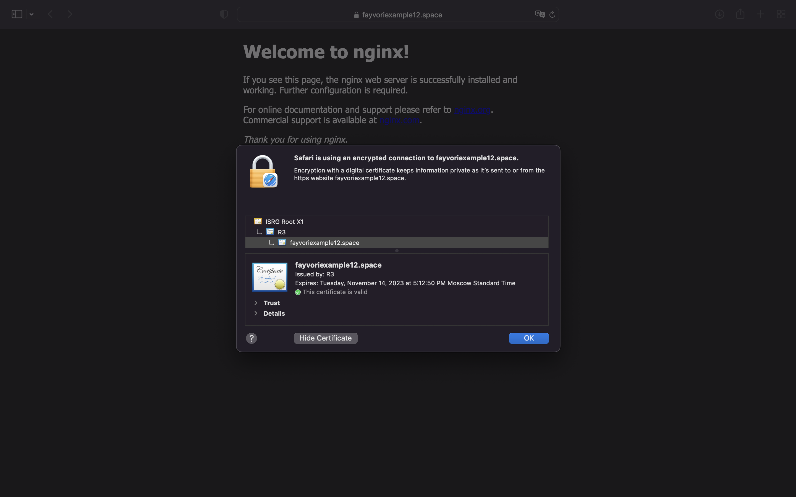

# Requirments

- Kubernetes cluster
- kubectl
- helm 
- Yandex Cloud
- Yandex Cloud CLI
- Availiable DNS address

# Note 

In order this example to work you need `kubernetes` cluster up and running. In order to create it go to the terraform folder and apply all the files

```bash
terraform init 
terraform apply
```

For obtaining yandex kubernetes config execute the following command

```bash
yc managed-kubernetes cluster get-credentials observability-k8s --external
```

# Implementation

*Don't forget to add `traefik` and `cert-manager` helm repos*

```bash 
helm repo add traefik https://traefik.github.io/charts
helm repo add jetstack https://charts.jetstack.io
helm repo update
```

First we need `ingress-controller`, I'll be using `traefik`, but you can choose whatever you want. Install `traefik` with command down below

```bash
helm install traefik traefik/traefik
```



If `traefik` deployed succesfully, you need to add it's `LoadBalancer` ip to your DNS provider (for example [reg.ru](https://www.reg.ru))



Now install `cert-manager` using helm

```bash
helm install cert-manager jetstack/cert-manager \
  --namespace cert-manager \
  --create-namespace \
  --version v1.12.0 \
  --set installCRDs=true
```



For sample application we deploy `bitnami/nginx`, we need to provide custom ingress values (you can find template inside `helm-values` folder)

*Don't forget to change `hostname` field in values file*

```bash
helm install nginx --values ./helm-values/nginx-values.yaml oci://registry-1.docker.io/bitnamicharts/nginx
```



In order to obtain ssl certificate apply a file from `manifests` folder called `cluster-certificate.yaml` (don't forger to change `email` field)

```bash
k apply -f ./manifests/cluster-certificate.yaml
```

And if all was successfully issued we can describe `cert-manager` crds



Now you can enter your domain in the browser and should be able to see that certificate was successfully applied


